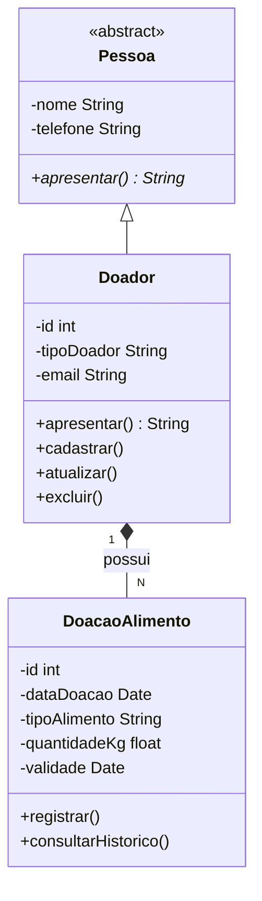
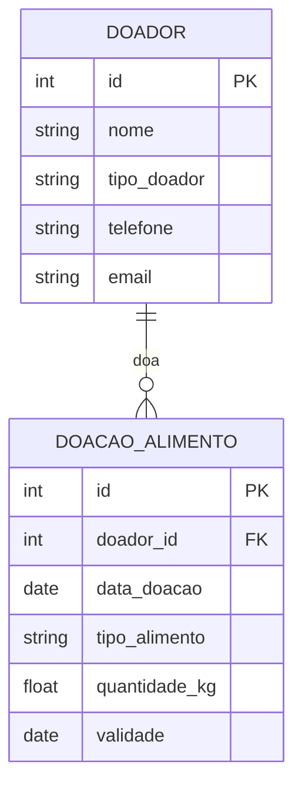

# Sistema de Banco de Alimentos

Projeto interdisciplinar (AEP — 4º semestre, Engenharia de Software / Análise e Desenvolvimento de Sistemas, Unicesumar) desenvolvido por Carlos Felipe Duta e Maria Vitória Arana Almeida.

## Descoberta

### Partes interessadas
- Instituições beneficiárias (ONGs, associações comunitárias, abrigos) que dependem de doações de alimentos para atender pessoas em situação de vulnerabilidade
- Doadores — pessoas físicas e empresas (mercados, restaurantes, produtores) que querem contribuir, mas muitas vezes não têm um canal organizado para isso
- Gestores do banco de alimentos, responsáveis por controlar entrada, validade e distribuição dos itens recebidos
- Pessoas em situação de vulnerabilidade — público beneficiado indiretamente pelo sistema, pois são as pessoas que recebem os alimentos por meio das instituições atendidas
- Sociedade/comunidade local — beneficiada de forma indireta pela melhoria na organização das doações e pela redução do desperdício de alimentos

### Principais dores identificadas
1. Falta de controle sobre a validade dos alimentos recebidos, gerando desperdício quando os itens vencem antes de serem distribuídos
2. Ausência de histórico organizado das doações, dificultando identificar doadores recorrentes e fortalecer parcerias
3. Cadastro informal ou inexistente dos doadores, o que prejudica a comunicação e o reconhecimento das contribuições
4. Dificuldade em priorizar a distribuição dos alimentos mais próximos do vencimento, o que aumenta o desperdício

### Origem do levantamento
A origem do levantamento está relacionada à necessidade de melhorar a organização e o controle das doações de alimentos realizadas por bancos de alimentos e iniciativas comunitárias. Em situações em que o controle é feito geralmente de maneira manual, por meio de planilhas, anotações ou registros separados, pode haver dificuldades para manter as informações organizadas e acompanhar corretamente os alimentos recebidos.

A partir dessa situação, foram identificadas necessidades relacionadas ao cadastro dos doadores, ao registro das doações, ao acompanhamento das datas de validade e à consulta do histórico de arrecadação. A dificuldade de visualizar quais alimentos estão próximos do vencimento também pode contribuir para que alguns produtos não sejam distribuídos dentro do prazo.

Dessa forma, o levantamento serviu como base para definir as principais funcionalidades do Sistema de Banco de Alimentos, buscando centralizar essas informações em um único sistema e facilitar o controle das doações, a identificação de alimentos próximos do vencimento e o acompanhamento do histórico de contribuições.

### Regras de negócio
- Toda doação deve estar vinculada a um doador previamente cadastrado, garantindo rastreabilidade do histórico
- Toda doação deve ter uma data de validade registrada, para permitir o alerta de vencimento
- Alimentos a poucos dias do vencimento (até 7 dias) devem ser sinalizados com prioridade de distribuição
- A quantidade doada (em kg) deve ser sempre um valor positivo, garantindo consistência dos dados
- O sistema distingue doador pessoa física de pessoa jurídica, já que isso impacta o tipo de reconhecimento/parceria
- Um doador não pode ser removido enquanto ainda possuir doações vinculadas, preservando o histórico de arrecadação
- Alimentos cuja data de validade já tenha passado devem ser identificados pelo sistema como vencidos
- Entre os alimentos disponíveis, aqueles que estiverem mais próximos do vencimento devem receber prioridade na distribuição
- O sistema deve permitir identificar a situação dos alimentos, como disponível ou vencido
- O cadastro de um doador deve possuir as informações necessárias para sua identificação e contato

## Concepção e alinhamento com o ODS

O Sistema de Banco de Alimentos foi concebido a partir da necessidade de melhorar a organização e o controle das doações de alimentos destinadas a instituições que atendem pessoas em situação de vulnerabilidade.

O sistema também busca facilitar o acompanhamento do histórico de doações, contribuindo para uma melhor organização das contribuições recebidas. Com a identificação dos alimentos próximos da validade, a ferramenta poderá auxiliar os responsáveis a definir quais itens devem receber prioridade na distribuição.

Assim, a tecnologia será utilizada como uma ferramenta de apoio à gestão do banco de alimentos, contribuindo para uma organização mais eficiente das informações e para a redução do desperdício causado pelo vencimento dos produtos antes de sua distribuição.

O projeto está alinhado ao **ODS 2 — Fome Zero e Agricultura Sustentável** da ONU, contribuindo para que alimentos doados cheguem a quem precisa antes de perderem a validade.

## Requisitos

1. O sistema deve permitir o cadastro de doadores (pessoa física ou jurídica), com nome, telefone e e-mail.
2. O sistema deve permitir o registro de uma doação de alimentos, associada a um doador, contendo tipo de alimento, quantidade em quilogramas e data de validade.
3. O sistema deve permitir consultar o histórico de doações de um doador específico.
4. O sistema deve permitir atualizar os dados cadastrais de um doador.
5. O sistema deve permitir remover o cadastro de um doador.
6. O sistema deve alertar (ou indicar) quais alimentos estão próximos da validade, para priorizar a distribuição.
7. O sistema deve manter o relacionamento entre doadores e suas respectivas doações, evitando a perda do histórico de arrecadação.
8. O sistema deve realizar validações nos dados inseridos, como impedir o cadastro de quantidades iguais ou menores que zero e garantir que uma doação esteja vinculada a um doador cadastrado.
9. O sistema deve permitir ordenar os alimentos pela data de validade, facilitando a identificação daqueles que precisam ser distribuídos primeiro.
10. O sistema deve permitir visualizar a quantidade total de alimentos registrada no sistema.
11. O sistema deve permitir identificar a situação de um alimento, como disponível, distribuído ou vencido.
12. O sistema deve permitir adicionar ou alterar informações de uma doação já registrada, quando necessário.
13. O sistema deve impedir o cadastro de uma doação caso algum dos dados obrigatórios não seja informado.

## Justificativa técnica e arquitetural

- **Linguagem: Java** — linguagem orientada a objetos madura, com suporte nativo a classes abstratas, interfaces, herança e à anotação `@Override` exigida no enunciado. Também é amplamente utilizada no conteúdo da disciplina de Programação Orientada a Objetos do curso.
- **Banco de dados: MySQL** — banco relacional gratuito, de fácil instalação via XAMPP/WAMP, com boa integração via JDBC. Atende ao requisito de persistência real (sem uso de listas em memória).
- **Arquitetura: em camadas simplificada (Model – DAO – Main)** — separa as classes de domínio (`Pessoa`, `Doador`, `DoacaoAlimento`) da lógica de acesso a dados (classes DAO responsáveis pelo CRUD via JDBC), facilitando manutenção e deixando o polimorfismo evidente na camada de modelo.

## Estrutura de pastas

```
Banco-de-Alimentos-AEP/
├── docs/
├── src/
├── database/
│   └── script-criacao.sql
└── README.md
```

## Diagrama de classe



## Diagrama do banco (DER)



## Cronograma

| Data | Atividade | Responsável |
|------|-----------|-------------|
| 05/09 | Definição do tema (banco de alimentos), descoberta, diagrama de classe | Carlos Felipe Duta |
| 05/09 | Partes interessadas, regras de negócio, requisitos e diagrama DER, concepção e alinhamento com o ODS | Maria Vitória Arana Almeida |
| 06/09 | Estrutura do repositório GitHub e README | Carlos Felipe Duta |
| 07/09 | Justificativa técnica e revisão dos diagramas | Maria Vitória Arana Almeida |
| 08/09 | Montagem do PDF da 1ª entrega | Carlos Felipe Duta |
| 09/09 | Revisão geral do PDF e do repositório | Carlos Felipe Duta |
| 10/09 | Ajustes finais / folga de segurança | Maria Vitória Arana Almeida |
| 11/09 | Entrega da 1ª etapa | Carlos Felipe Duta |
| A definir | Implementação do CRUD em Java + conexão MySQL (2ª entrega) | Todos |
| A definir | Testes finais e entrega do código-fonte (2ª entrega) | Todos |

