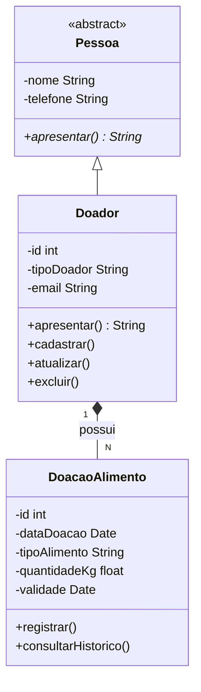
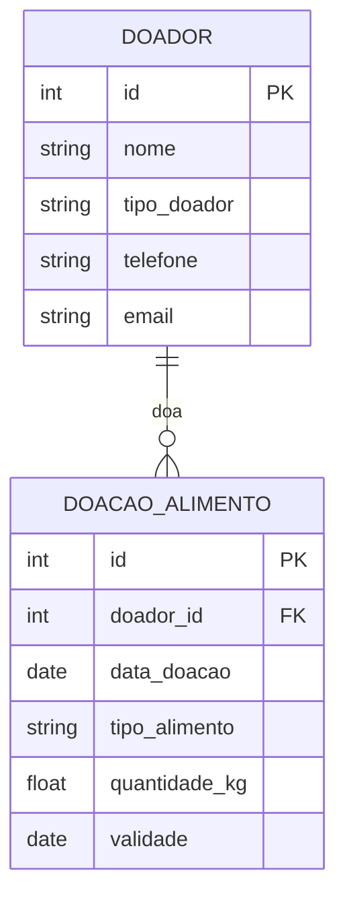

# Sistema de Banco de Alimentos

Projeto interdisciplinar (AEP — 4º semestre, Análise e Desenvolvimento de Sistemas, Unicesumar) desenvolvido individualmente por Carlos Felipe Duta.

Descoberta

Partes interessadas
- Instituições beneficiárias (ONGs, associações comunitárias, abrigos) que dependem de doações de alimentos para atender pessoas em situação de vulnerabilidade
- Doadores — pessoas físicas e empresas (mercados, restaurantes, produtores) que querem contribuir, mas muitas vezes não têm um canal organizado para isso
- Gestores do banco de alimentos, responsáveis por controlar entrada, validade e distribuição dos itens recebidos

Principais dores identificadas
1. Falta de controle sobre a validade dos alimentos recebidos, gerando desperdício quando os itens vencem antes de serem distribuídos
2. Ausência de histórico organizado das doações, dificultando identificar doadores recorrentes e fortalecer parcerias
3. Cadastro informal ou inexistente dos doadores, o que prejudica a comunicação e o reconhecimento das contribuições
4. Dificuldade em priorizar a distribuição dos alimentos mais próximos do vencimento, o que aumenta o desperdício

Origem do levantamento
Essas dores partem de práticas comuns em pequenas iniciativas comunitárias de doação de alimentos, que costumam depender de controle manual — planilhas soltas ou registro em papel — sujeito a erros, perda de informação e falta de visibilidade sobre o que está prestes a vencer.

Regras de negócio
- Toda doação deve estar vinculada a um doador previamente cadastrado, garantindo rastreabilidade do histórico
- Toda doação deve ter uma data de validade registrada, para permitir o alerta de vencimento
- Alimentos a poucos dias do vencimento (até 7 dias) devem ser sinalizados com prioridade de distribuição
- A quantidade doada (em kg) deve ser sempre um valor positivo, garantindo consistência dos dados
- O sistema distingue doador pessoa física de pessoa jurídica, já que isso impacta o tipo de reconhecimento/parceria
- Um doador não pode ser removido enquanto ainda possuir doações vinculadas, preservando o histórico de arrecadação

## Concepção e alinhamento com o ODS

O sistema apoia o controle de doações de alimentos para instituições que atendem pessoas em situação de vulnerabilidade, organizando o cadastro de doadores e o histórico de doações recebidas, com foco em reduzir o desperdício de alimentos que vencem antes de serem distribuídos. Está alinhado ao ODS 2 — Fome Zero e Agricultura Sustentável da ONU, contribuindo para que alimentos doados cheguem a quem precisa antes de perderem a validade.

## Requisitos

1. O sistema deve permitir o cadastro de doadores (pessoa física ou jurídica), com nome, telefone e e-mail.
2. O sistema deve permitir o registro de uma doação de alimentos, associada a um doador, contendo tipo de alimento, quantidade em kg e data de validade.
3. O sistema deve permitir consultar o histórico de doações de um doador específico.
4. O sistema deve permitir atualizar os dados cadastrais de um doador.
5. O sistema deve permitir remover o cadastro de um doador.
6. O sistema deve alertar (ou indicar) quais alimentos estão próximos da validade, para priorizar a distribuição.

Justificativa técnica e arquitetural

- Linguagem: Java — linguagem orientada a objetos madura, com suporte nativo a classes abstratas, interfaces, herança e à anotação @Override exigida no enunciado. Também é amplamente utilizada no conteúdo da disciplina de Programação Orientada a Objetos do curso.
- Banco de dados: MySQL — banco relacional gratuito, de fácil instalação via XAMPP/WAMP, com boa integração via JDBC. Atende ao requisito de persistência real (sem uso de listas em memória).
- Arquitetura: em camadas simplificada (Model – DAO – Main) — separa as classes de domínio (Pessoa, Doador, DoacaoAlimento) da lógica de acesso a dados (classes DAO responsáveis pelo CRUD via JDBC), facilitando manutenção e deixando o polimorfismo evidente na camada de modelo.

## Estrutura de pastas

```
projeto-banco-alimentos/
├── docs/
│   ├── diagrama-classe.md
│   ├── diagrama-der.md
│   └── requisitos.md
├── src/
│   └── (código-fonte Java — implementado na 2ª entrega)
├── database/
│   └── script-criacao.sql
└── README.md
```

## Diagrama de classe



## Diagrama do banco (DER)



## Cronograma

| Data | Atividade | Responsável |
|------|-----------|-------------|
| 05/09 | Definição do tema (banco de alimentos), descoberta, requisitos, diagrama de classe e DER | Carlos Felipe Duta |
| 06/09 | Estrutura do repositório GitHub e README | Carlos Felipe Duta |
| 07/09 | Justificativa técnica e revisão dos diagramas | Carlos Felipe Duta |
| 08/09 | Montagem do PDF da 1ª entrega | Carlos Felipe Duta |
| 09/09 | Revisão geral do PDF e do repositório | Carlos Felipe Duta |
| 10/09 | Ajustes finais / folga de segurança | Carlos Felipe Duta |
| 11/09 | Entrega da 1ª etapa | Carlos Felipe Duta |
| A definir | Implementação do CRUD em Java + conexão MySQL (2ª entrega) | Carlos Felipe Duta |
| A definir | Testes finais e entrega do código-fonte (2ª entrega) | Carlos Felipe Duta |

